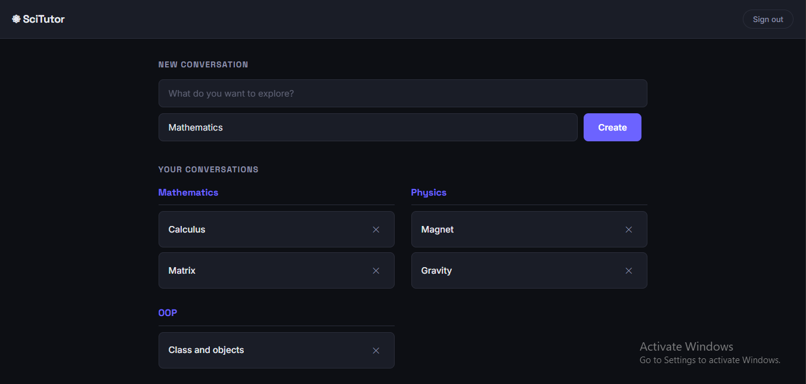
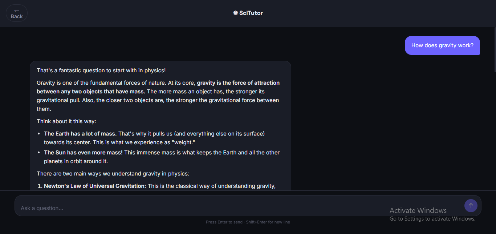

# ⚛ SciTutor — AI Science Tutor

An AI-powered science tutoring web app where students can have subject-specific conversations with an AI tutor. Built with React, Node.js, Express, PostgreSQL, and the Gemini API.

**Live Demo:** https://ai-science-tutor.vercel.app

---

## Screenshots

### Homepage


### Dashboard


### Chat


---

## Features

- **JWT Authentication** — secure register and login with bcrypt password hashing
- **Subject-scoped AI** — the AI tutor is restricted to the selected subject using a dynamic system prompt
- **Persistent conversations** — full chat history saved to PostgreSQL and restored on every visit
- **Markdown and math rendering** — AI responses render bold, bullet points, and LaTeX math formulas correctly
- **Conversations grouped by subject** — dashboard organises your chats under their subject headings
- **Responsive design** — works on mobile and desktop

---

## Tech Stack

**Frontend**
- React + Vite
- React Router DOM
- Axios
- React Markdown + KaTeX (math rendering)

**Backend**
- Node.js + Express
- PostgreSQL (Neon)
- bcrypt
- JSON Web Tokens (JWT)
- Gemini API (Google AI)

**Deployment**
- Frontend → Vercel
- Backend → Render
- Database → Neon (serverless PostgreSQL)

---

## Getting Started

### Prerequisites
- Node.js v18+
- A [Neon](https://neon.tech) PostgreSQL database
- A [Gemini API key](https://aistudio.google.com)

### 1. Clone the repo

```bash
git clone https://github.com/111girish/Ai-science-tutor
cd Ai-science-tutor
```

### 2. Set up the database

Run the schema in your Neon SQL editor:

```sql
CREATE TABLE users(
  user_id SERIAL PRIMARY KEY,
  full_name VARCHAR(100) NOT NULL,
  user_name VARCHAR(30) UNIQUE NOT NULL,
  password VARCHAR(255) NOT NULL,
  email TEXT UNIQUE NOT NULL,
  created_at TIMESTAMP DEFAULT CURRENT_TIMESTAMP
);

CREATE TABLE subjects(
  subject_id SERIAL PRIMARY KEY,
  subject TEXT UNIQUE NOT NULL
);

CREATE TABLE conversations(
  conversation_id SERIAL PRIMARY KEY,
  user_id INTEGER REFERENCES users(user_id) ON DELETE CASCADE,
  subject_id INTEGER REFERENCES subjects(subject_id),
  title TEXT NOT NULL,
  created_at TIMESTAMP DEFAULT CURRENT_TIMESTAMP
);

CREATE TABLE messages(
  message_id SERIAL PRIMARY KEY,
  conversation_id INTEGER REFERENCES conversations(conversation_id) ON DELETE CASCADE,
  sender VARCHAR(10) CHECK (sender IN ('user','ai')),
  content TEXT NOT NULL,
  created_at TIMESTAMP DEFAULT CURRENT_TIMESTAMP
);
```

Then seed the subjects:

```sql
INSERT INTO subjects (subject) VALUES
('Mathematics'), ('Physics'), ('Chemistry'),
('ECM'), ('Digital Logic'), ('OOP');
```

### 3. Configure the server

Create `server/.env`:

```
PORT=5000
DB_CONNECT=your_neon_connection_string
ACCESS_TOKEN=your_jwt_secret
GEMINI_API_KEY=your_gemini_api_key
FRONTEND_URL=http://localhost:5173
NODE_ENV=DEVELOPMENT
```

### 4. Configure the client

Create `client/.env`:

```
VITE_API_URL=http://localhost:5000
```

### 5. Install dependencies and run

```bash
# Server
cd server
npm install
npm start

# Client (new terminal)
cd client
npm install
npm run dev
```

Open http://localhost:5173

---

## Project Structure

```
ai-science-tutor/
├── client/
│   ├── src/
│   │   ├── api/          # Axios API functions
│   │   ├── pages/        # Login, Register, Dashboard, Chat
│   │   └── components/
│   └── .env
└── server/
    ├── controllers/      # Route handler logic
    ├── routes/           # Express route definitions
    ├── middleware/        # JWT authentication
    ├── utils/
    │   └── gemini.js     # Gemini API integration
    ├── db.js             # PostgreSQL connection
    └── index.js          # Express entry point
```

---

## Author

**Girish Pokhrel**
- GitHub: [@111girish](https://github.com/111girish)
- LinkedIn: [girish-pokhrel](https://linkedin.com/in/girish-pokhrel-a0663023a)
- Email: pokhrelgirish94@gmail.com